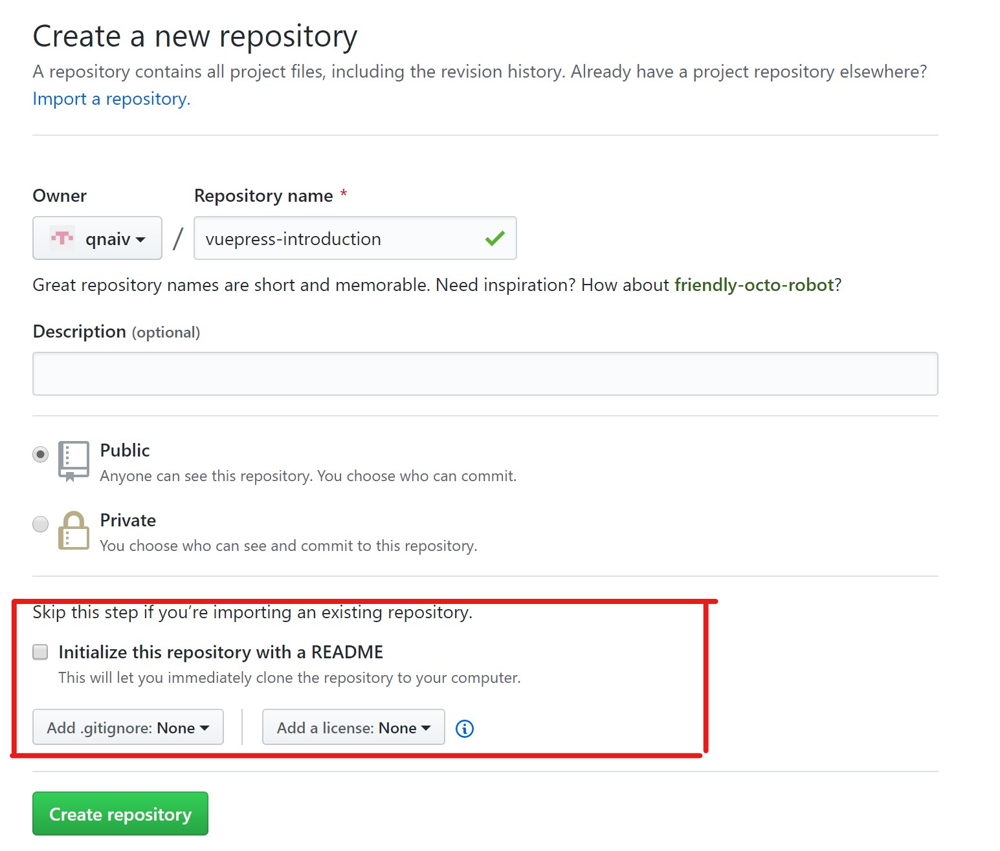
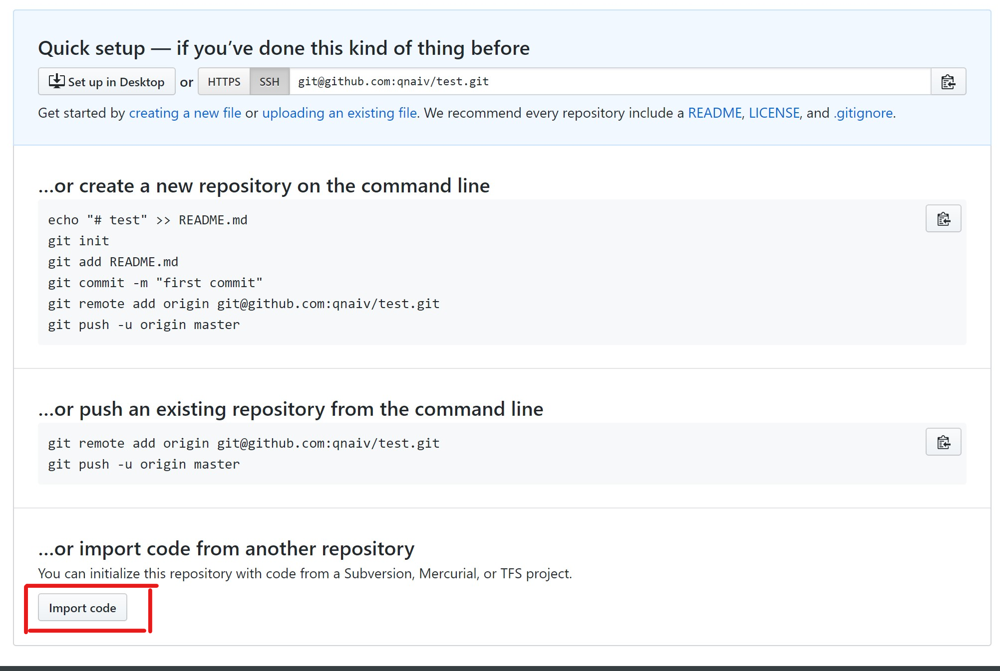
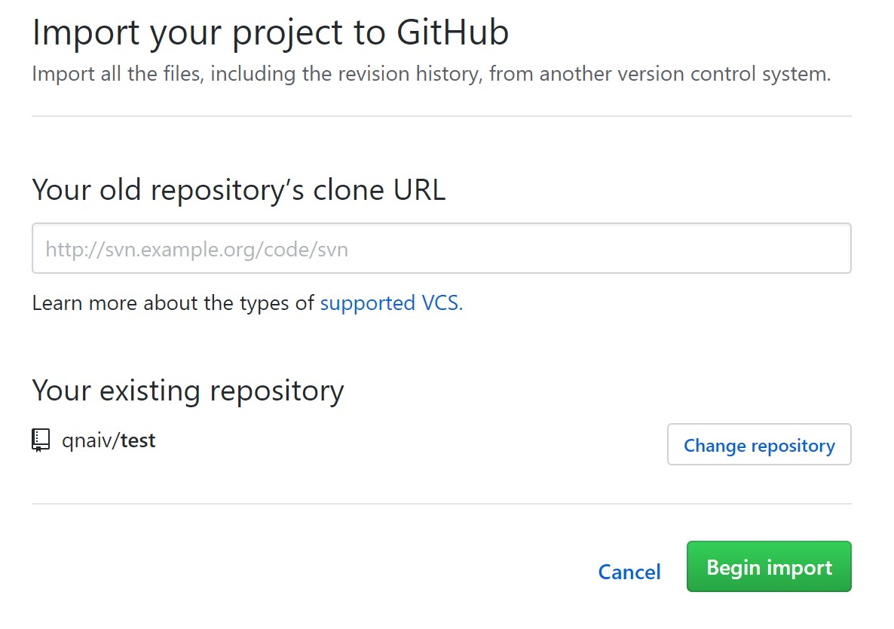

# Githubで自分のリポジトリをforkする

## このページで分かること
- 自分のリポジトリを複製して新しいリポジトリを作る方法

## やり方
### リポジトリを作成する
::: warning
`Initialize this repository with a README`にチェックを入れないこと
:::

### 下のほうの`import code`を押す

### コピーしたいリポジトリのURLを入力
