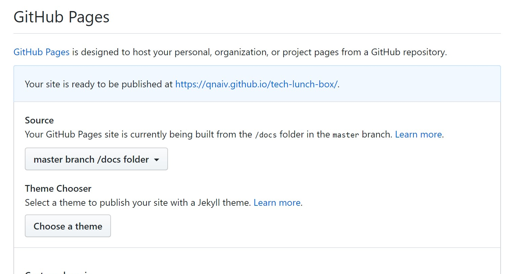

# vuepressで作った静的サイトをGithub pagesで公開するまで

## このページで分かること
- 1からvuepressの導入する方法・基本的な使い方
- Github pagesで静的サイトを公開する方法

## vuepressを導入する
```sh
# gitclone
git clone [url]

# package.json作成
npm init

# vuepressインストール
npm install -D vuepress

# docディレクトリ(ビルド後ファイルの出力先)作成
mkdir docs

# srcディレクトリ作成
mkdir src

# テストページ作成
echo '# Hello VuePress' > README.md

# 設定ファイルを格納するディレクトリ作成
mkdir src/.vuepress
```

## package.json編集
`package.json`の`scripts`に以下の記述を追加する
```json
"scripts": {
  "dev": "vuepress dev src",
  "build": "vuepress build src"
},
```


## vuepress設定ファイル作成
`docs/.vuepress/`に`config.js`を作成し、以下の設定を記述する。
```js
module.exports = {
    // サイト名
    title: "サイト名",
    // ビルド後ファイル出力先
    dest: "docs",
    // カスタムドメインを使用しない場合はbaseにgithubのリポジトリ名を設定
    // base: '/リポジトリ名/',
    markdown: {
      // ソースコードに行数を表示する。
      lineNumbers: true
    }
}
```

ここまでの内容をcommit & pushする。

## Github pagesの設定
githubリポジトリの設定ページでsourceを`master branch/docs folder`にする。



## 完了
https://`ユーザ名`.github.io/`リポジトリ名`/で表示される。