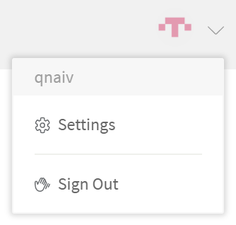
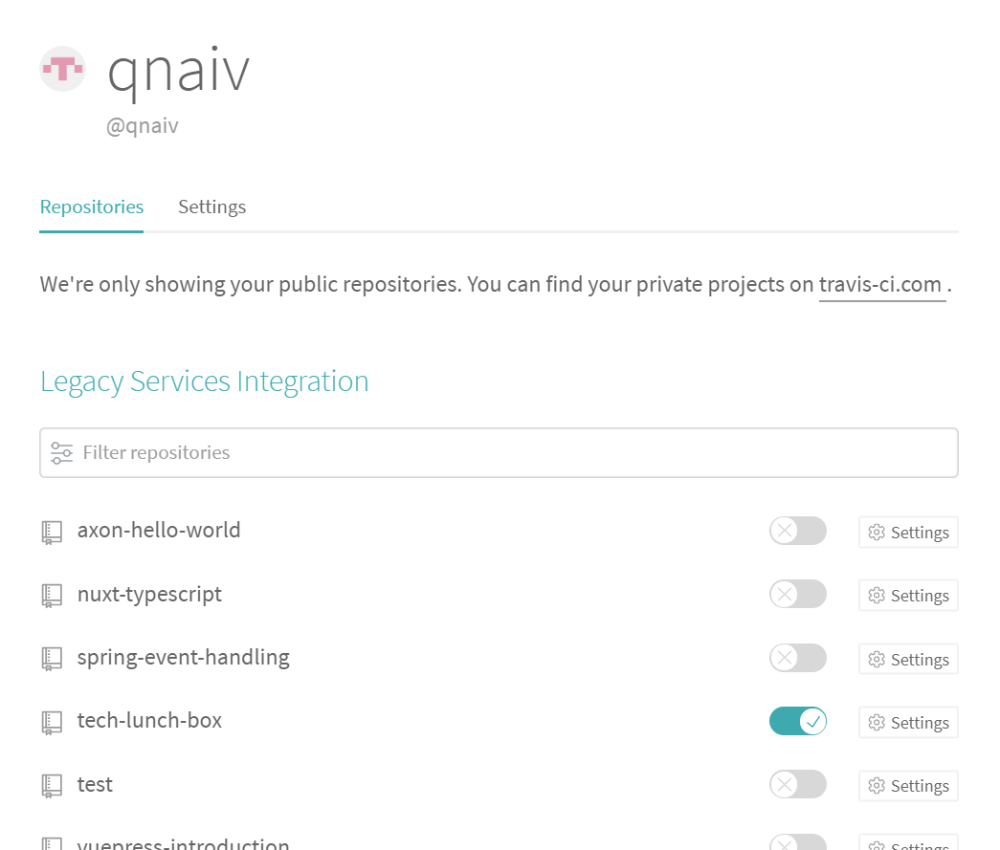
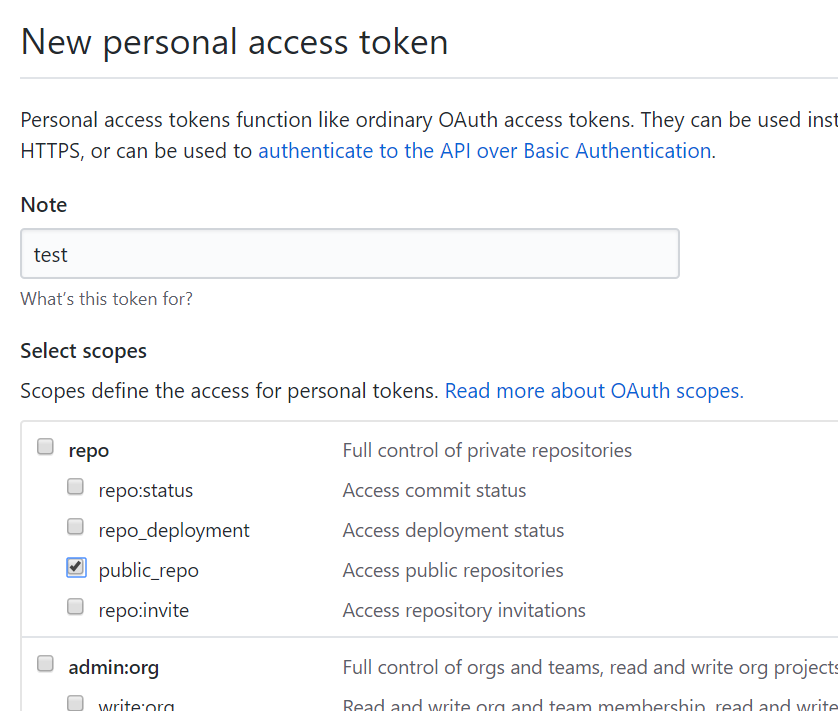
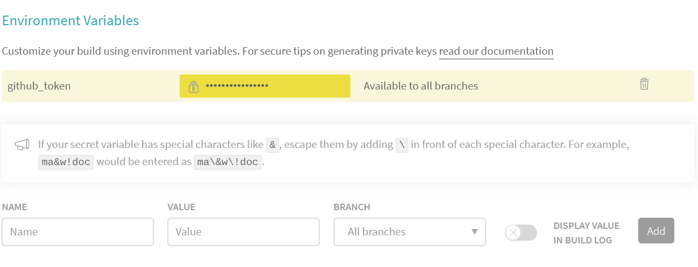
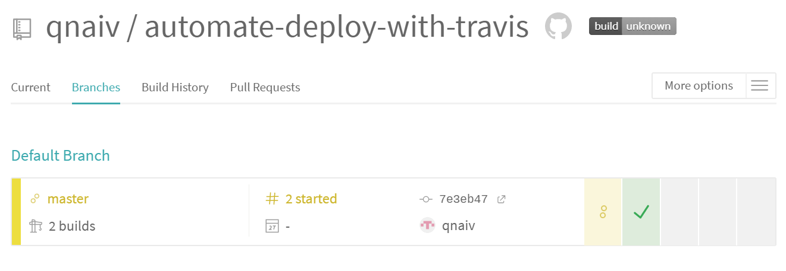

# Travis CIでVuepressの公開を自動化する

## このページでわかること
- Travis CIの基礎
- markdownファイルをpushされたとき、Vuepressサイトが自動ビルドする手順

## 前提条件
以下の作業が完了していること  
[vuepressで作った静的サイトをGithub pagesで公開するまで](/src/posts/2019/06/15/vuepress-introduction.md)

## Travis CIとは
CI/CDサービス。  
特定のタイミング(リポジトリPush時など)で、テスト/デプロイを自動実行することができる。
Githubのpublicリポジトリなら無料で利用することが可能。  

## 導入

### 1. アカウントを作成する
Githubアカウントでログイン可能。

### 2. リポジトリを有効化する
右上のSettingsから設定画面を開き、デプロイ自動化したいリポジトリを有効化する。





### 3. GIthubのアクセストークンを取得してTravisに登録する。

1. Githubのユーザ設定 > Developer settings > Personal access tokens画面を開く
2. Generate new tokenを押す。
3. Noteに好きな識別子を入力し、public_repoにチェックを入れる。


4. 緑色の部分にアクセストークンが表示されるのでコピーする。


5. Travis CIのリポジトリ設定画面を開き、`Environment Variables`の`name`を好きな文字列に、`value`を先ほどコピーしたtokenを入力する。


### 4. `.travis.yml`を作成する
``` yml
script:
  - npm install
  - npm run build
deploy:
  provider: pages
  skip_cleanup: true
  github_token: $github_token
  keep_history: true
  local-dir: .vuepress/dist
  on:
    branch: master
```

### 5. 完了
`.travis.yml`をpushした瞬間から、自動デプロイが動くようになる。
