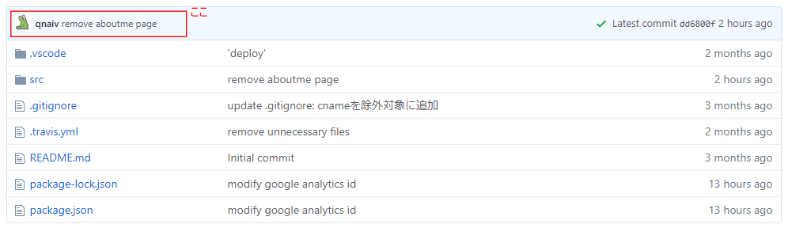
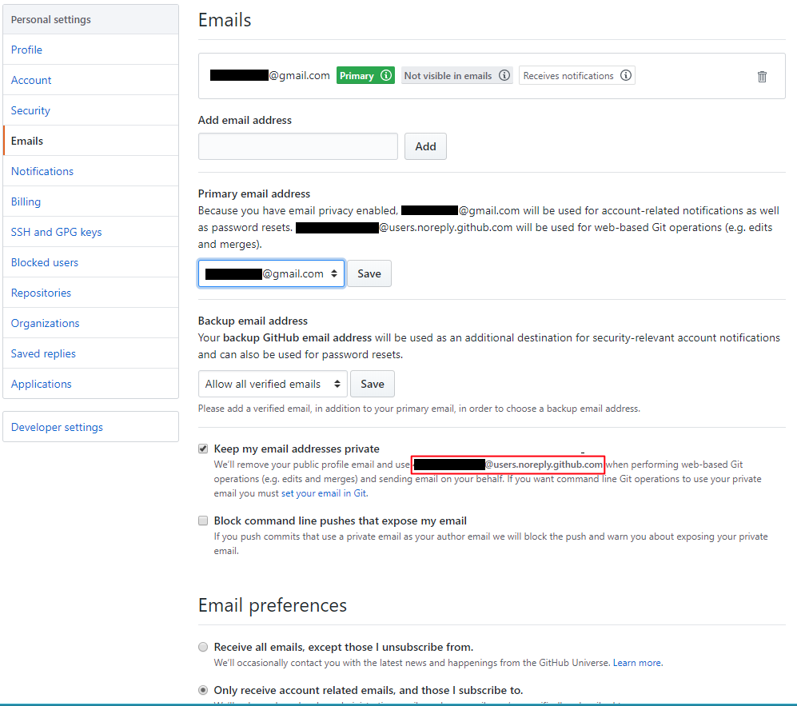

# Githubのコミッター名をGithubアカウントと同じにする
Githubに`git push`する際、Githubのアカウント名義でコミットする方法が分かりづらかった。

## git configでメールアドレスを設定する
以下のコマンドでuser.emailを設定する。

` git config --global user.email="メールアドレス"`

## 重要ポイント
user.emailに設定するアドレスを間違えててつまずいた。

Githubでメールアドレスを…

**公開状態にしている場合**
- Githubに登録したメールアドレスをそのまま設定する。

**非公開状態にしている場合**
- noreplyメールアドレスを設定する。

## noreplyメールアドレスの確認方法
**Keep my email addressses private**(メールアドレスを非公開にする)にチェックがついている場合、赤枠で囲んだ部分に書かれているメールアドレスを`user.email`に設定する必要がある。
