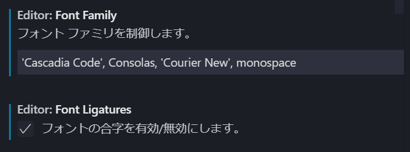
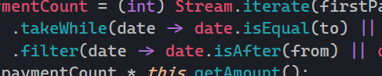

# VSCode で Cascadia code を利用する

Microsoft が 9 月 18 日に発表したターミナル/コードエディタに最適化されたフォント「Cascadia code」を VS Code に導入してみた。

[https://devblogs.microsoft.com/commandline/cascadia-code/](https://devblogs.microsoft.com/commandline/cascadia-code/)

## 導入

### 1. フォントをダウンロード

`Cascadia.ttf`をダウンロードする。
[https://github.com/microsoft/cascadia-code/releases](https://github.com/microsoft/cascadia-code/releases)

### 2. インストール

ダウンロードした`Cascadia.ttf`を右クリックしてインストールする。

### 3. VSCode の設定を変更

- `Font Family`に\`Cascadia Code\`を追加。
- `Font Lignatures`の`フォントの合字を有効/無効にします。`にチェックを入れる。

完了。

こんな感じで合字で表示されるようになる。

