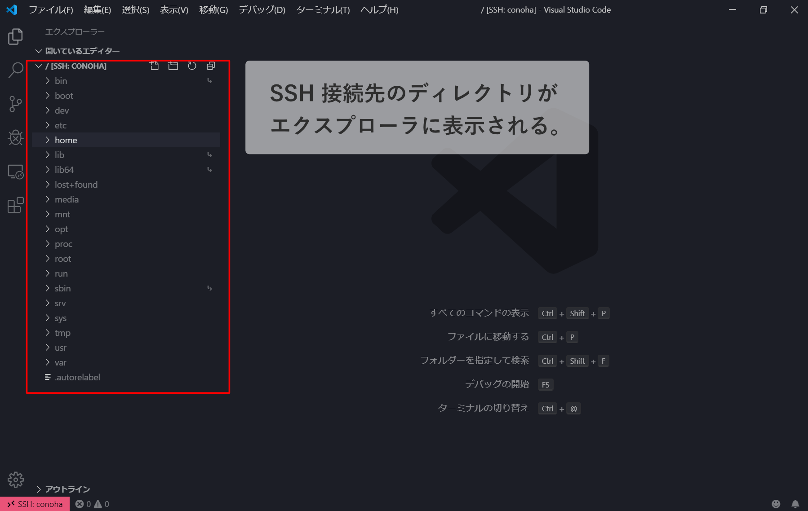

# VSCode で SSH 接続する

## 拡張機能をインストール

Remote - SSH
[https://marketplace.visualstudio.com/items?itemName=ms-vscode-remote.remote-ssh](https://marketplace.visualstudio.com/items?itemName=ms-vscode-remote.remote-ssh)

## SSH 接続先を追加

左下のアイコンをクリックし、`Open Configuration file...`をクリック


config ファイルを作成されるので、下記の内容を記述する。

```
Host 任意の接続名
HostName ホスト名
User ユーザー名
Port ポート番号
IdentityFile 鍵の場所(例: ~/.ssh/test.key)
```

## SSH で接続する

1. 左下のアイコンをクリック
2. `Connect to Host...`をクリック
   

3. 接続先の接続名を選択
   

### ターミナルから操作する

`Ctrl + @`で SSH 接続先のターミナルが表示される。


### エクスプローラに接続先のディレクトリを表示する

`フォルダーを開く`をクリック


ルートにするディレクトリを選択して`OK`をクリック


SSH 接続先のディレクトリがエクスプローラに表示される。

